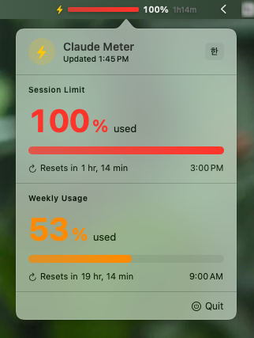
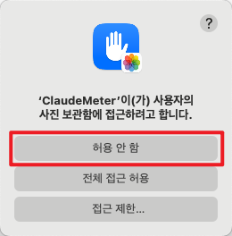

# ClaudeMeter

macOS menu bar app that shows your Claude Code usage in real time.

 

---

<p align="center">
  
</p>

## What it does

- **Menu bar icon** — live progress bar and percentage of your current session limit
- **Click to expand** — session usage and weekly usage, each with a gauge and time until reset
- **Auto-refreshes** every 30 seconds by running `claude /usage` in a PTY — no API calls, no tokens consumed

## How it works

ClaudeMeter spawns a Python subprocess that opens a pseudo-terminal (PTY), starts `claude`, sends `/usage`, and parses the output. It reads exactly what you'd see in your terminal and surfaces two numbers:

| | Source |
|---|---|
| Current session usage | First `XX% used` in `/usage` output |
| Weekly usage | Second `XX% used` in `/usage` output |

## Requirements

- macOS 13 Ventura or later
- [Claude Code](https://claude.ai/claude-code) installed (`claude` on your `$PATH`)
- Python 3 (ships with macOS)

## Install

### Option A — DMG (easiest)

1. Download `ClaudeMeter.dmg` from the [Releases](https://github.com/Arc1el/claude-meter/releases) page
2. Open the DMG and drag **ClaudeMeter** into **Applications**
3. Launch from Applications or Spotlight — no Dock icon will appear

### Option B — Build from source

```bash
git clone https://github.com/Arc1el/claude-meter
cd claude-meter
bash build.sh
```

`build.sh` compiles a release binary, packages `ClaudeMeter.app`, signs it ad-hoc, produces `ClaudeMeter.dmg`, and prompts you to copy the app to `/Applications`.

To build without any prompts:

```bash
swift build -c release
```

## Run

```bash
open ClaudeMeter.app
```

ClaudeMeter runs as a menu bar agent — no Dock icon. To quit, click the icon → **Quit**.

## Project structure

```
claude-meter/
├── Package.swift
├── build.sh                        # Build, bundle, sign, optional install
└── Sources/ClaudeMeter/
    ├── ClaudeMeterApp.swift        # @main entry point
    ├── AppDelegate.swift           # NSStatusItem + NSPopover
    ├── StatusBarView.swift         # Menu bar progress bar (SwiftUI)
    ├── MenuBarView.swift           # Popover — session & weekly gauges
    └── StatsManager.swift          # ObservableObject, PTY fetch, 30s timer
```

## Permissions

ClaudeMeter itself requests **no system permissions**. It only reads from the filesystem and spawns a subprocess.

However, macOS may show permission dialogs (Photos, Microphone, etc.) and attribute them to ClaudeMeter. This happens because ClaudeMeter launches the `claude` CLI via a PTY subprocess, and macOS sometimes attributes the child process's permission requests to the parent app.

<p align="center">
  
</p>

**You can safely deny all such requests.** ClaudeMeter will continue to work normally regardless.

If these dialogs are disruptive, open **System Settings → Privacy & Security** and set the relevant entries for ClaudeMeter to *Don't Allow*.

## License

MIT
